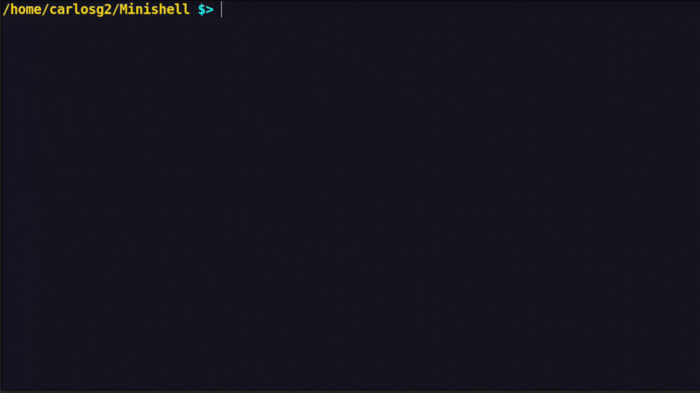

# 🐚 MiniShell

A simple Unix shell implementation built in C. This project mimics the basic functionality of a shell, including command execution, pipes, redirections, and signal handling. It is developed following **42 School** guidelines.

✅ Fully tested on **Linux** (complete functionality on other OSes is not guaranteed)

## 🚀 Features

✅ Execute built-in and external commands
✅ Handle input/output redirections (`>`, `>>`, `<`)
✅ Support for pipes (`|`)
✅ Environment variable expansion (`$VAR`)
✅ Signal handling (`Ctrl + C`, `Ctrl + D`, `Ctrl + \`)
✅ Custom prompt
✅ Heredoc (`<<`)
✅ Support for command history
✅ Proper error handling and messages
✅ Memory management to prevent leaks

## 🛠️ Installation

1️⃣ Clone the repository:
```bash
git clone https://github.com/CarlosGarciaSanchez19/Minishell
cd minishell
```

2️⃣ Compile the project:
```bash
make
```

3️⃣ Run MiniShell:
```bash
./minishell
```

## 📖 Usage

Run commands like in a regular shell:



To exit, type `exit` or press `Ctrl + D`.

## 🏗️ Built-ins

- `echo` 🗣️ - Print text to the console
- `cd` 📂 - Change directory
- `pwd` 📍 - Show current directory
- `export` 🌍 - Set environment variables
- `unset` ❌ - Remove environment variables
- `env` 🌱 - Display environment variables
- `exit` 🚪 - Close the shell

## ⚡ Signals

- `Ctrl + C` ⛔ - Interrupt running process
- `Ctrl + D` 👋 - Exit shell
- `Ctrl + \` 🚫 - Doesn't do anything

## 🛠️ Compilation

The project uses the following compilation flags:
```make
CFLAGS = -Wall -Wextra -Werror
```

## 👨‍💻 Authors

Developed by:
- **Carlos García Sánchez** 🎩
- **Daniel Soriano Martín** 🔧

## 📜 License

This project is for educational purposes and follows the **42 School** norms.

Happy programming! 🚀

